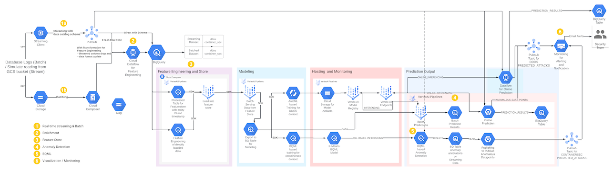

# Solution Accelerators

This repository contains end-to-end walkthrough of solution to solve a specific technical challenge by accelerating the development and deployment of software components and related documentation. In the first wave, the Solution Accelerator for [Security Analytics](#security-analytics) is released.

## Security Analytics

This repository contains an end-to-end walkthrough to leverage Google Cloud services to demonstrate a Solution Accelerator for Security Analytics. The Solution Accelerator starts from - ingesting real-time / streaming and batch data into BigQuery, developing models using Vertex AI and BQML to detect and report anomalies of security attacks and using Looker Studio to visualize the details. A subset of public datasets and generated data are used to simulate the flow.  

### Table of Contents

- [Security Analytics Solution Accelerator](#security-analytics)
  - [Table of Contents](#table-of-contents)
  - [Introduction](#introduction)
  - [High Level Architecture](#high-level-architecture)
  - [Tech Stack](#tech-stack)
  - [Hands-on](#hands-on)
    - [Bootstrap](#bootstrap)
    - [Realtime Ingestion](#realtime-ingestion)
    - [Data Enrichment](#data-enrichment)
    - [Feature Store](#feature-store)
    - [Anomaly Detection](#anomaly-detection)
    - [BigQuery ML](#bigquery-ml)
    - [Visualization](#visualization)
    - [Cleanup](#cleanup)
  - [Versioning](#versioning)
  - [Code of Conduct](#code-of-conduct)
  - [Contributing](#contributing)
  - [License](#license)

### Introduction

The Solution Accelerator is developed to create core Google Cloud infrastructure for Data Ingestion pipeline with support for Batch and Real-time data, support Transformations using the out of the box Templates, letting the data flow through a MLOps pipeline exhibiting data collection, processing, modeling, anomaly detection and visualization. These key elements can be used in the Security and Analytics domain around below use cases.

- Analyzing network traffic to identify patterns that indicate a potential attack
- Detect insider threats or malicious activity
- Incident response and forensics (using logs)
- Manage third and fourth-party vendor risk
- User Behavior Analysis
- Data exfiltration Detection (Perhaps in conjunction with VPC Service Controls)

### High Level Architecture

The labelled numbers (1-6) correspond to the Sprint cycle, each explaining the data journey in great detail.

| Sprint | Description | Cost | Duration |
|---|---|---|---|
| 1. Realtime Ingestion | [Google Cloud PubSub](https://cloud.google.com/pubsub) is used to stream data in real-time to [BigQuery](https://cloud.google.com/bigquery) using JSON log format | $0 | 10mins |
| 2. Enrichment | [Dataflow](https://cloud.google.com/dataflow) is used with PubSub to stream data to BigQuery | $0 | 10mins |
| 3. Feature Store | Dataflow is used to store data from [Google Cloud Storage](https://cloud.google.com/storage) into [Vertex AI FeatureStore](https://cloud.google.com/vertex-ai) | $10 an hr | 45mins |
| 4. Anomaly detection | Anomaly detection is demonstrated using FeatureStore and AutoML and [Vertex AI Model Registry](https://cloud.google.com/vertex-ai/docs/model-registry/introduction) | $10 an hr 1 | 45mins 2 |
| 5. BigQueryML | Data stored in BigQuery is leveraged to develop a [BigQueryML model](https://cloud.google.com/bigquery/docs/bqml-introduction) for Anomaly detection | $16 1 | 20mins |
| 6. Visualization | Anomaly detection dashboard is developed using [Looker Studio](https://lookerstudio.google.com) that shows the various data paths and trigger patterns. Custom dashboard can be developed depending on use cases. | $16 1 | 10mins |
| Clean up |  Tear down of resources from previous sprints | $0 | 20mins |

[1] Cost includes the previous sprints

[2] There is an alternative by developing a model, train and deploy which last for 4 hours

The above journey of data from Log ingestion, enriching logs and inference can be walked through using different data sets.

### Tech Stack

- Python 3.7
- Terraform / HCL (HashiCorp Configuration Language)
- Shell scripting
- Google Cloud services

### Hands-on

#### Bootstrap

This is the first step that creates the foundational infrastructure needs for the remaining sprints.
Click [here for instructions](security-analytics/src/00_bootstrap/README.md).

> **Note**
> Do not skip this step. This step lays down foundational scripts needed to automate the infrastructure provision from Sprints 1 through end.

#### Realtime Ingestion

This sprint shows reading data from a file to simulate a real-time experience and ingesting to a Cloud PubSub topic and storing into a BigQuery table. Cloud PubSub to BigQuery ingestion is done via PubSub BigQuery subscription.
Click [here for instructions](security-analytics/src/01_realtime_ingestion/README.md).

#### Data Enrichment

This sprint shows reading data from a file to simulate a real-time experience and ingesting to a Cloud PubSub topic and storing into a BigQuery table. Cloud PubSub to BigQuery ingestion is done via Dataflow. Dataflow is also doing data enrichment. Click [here for instructions](security-analytics/src/02_enrichment_dataflow/README.md).

#### Feature Store

This sprint shows a feature engineering platform for Security Analytics. Milestone involve building an enrichment pipeline that reads data from GCS to a Dataflow job that writes to Vertex AI Feature Store. Click [here for instructions](security-analytics/src/03_feature_store/README.md).

#### Anomaly Detection

This sprint demonstrates anomaly detection using FeatureStore and AutoML and Vertex AI Model Registry. Click [here for instructions](security-analytics/src/04_anomaly_detection/README.md).

#### BigQuery ML

This sprint uses data from streaming and batching datasets to train a K-Means model for clustering. Anomaly detection is demonstrated and results are stored in a BigQuery table. All anomalies are alerted using PubSub. Click [here for instructions](security-analytics/src/05_bqml/README.md).

#### Visualization

This sprint demonstrates a dashboard developed using [Looker Studio](https://lookerstudio.google.com) that shows the various data paths and trigger patterns of Anomaly detection. Click [here for instructions](security-analytics/src/06_visualization/README.md).

#### Cleanup

For resources created and managed by terraform: execute `terraform destroy` in reverse order. For resources created and managed outside of terraform (created by the pipelines and predictions / models): execute the relevant scripts from the `utils` directory. Click [here for instructions](security-analytics/src/07_cleanup/README.md).

## Versioning

Initial Version August 2023

## Code of Conduct

[View](./CODE_OF_CONDUCT.md)

## Contributing

[View](./CONTRIBUTING.md)

## License

[View](./LICENSE)
