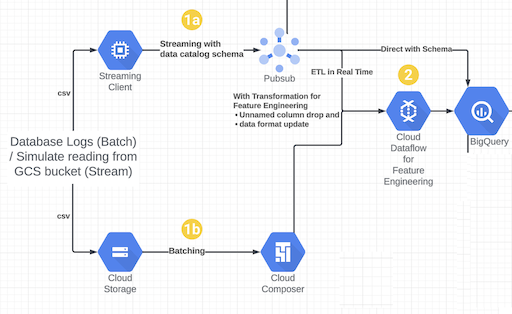

# Solution Accelerator for Security Analytics - Sprint 1: Realtime Ingestion

This sprint shows reading data from a file to simulate a real-time experience and ingesting to a Cloud PubSub topic and storing into a BigQuery table.
Cloud PubSub to BigQuery ingestion is done via [PubSub BigQuery subscription](https://cloud.google.com/pubsub/docs/bigquery).

## Tables of Contents

- [Solution Accelerator for Security Analytics - Sprint 1: Realtime Ingestion](#solution-accelerator-for-security-analytics---sprint-1-realtime-ingestion)
  - [Overview](#overview)
  - [Components in action](#components-in-action)
  - [Prerequisites](#prerequisites)
  - [Steps](#steps)
  - [Exit criteria / e2e validation](#exit-criteria--e2e-validation)
  - [Resources created](#resources-created)
  - [Troubleshooting](#troubleshooting)

All sprints

- [Bootstrap](../00_bootstrap/README.md)
- [Sprint 1 - Realtime Ingestion](../01_realtime_ingestion/README.md) (current)
- [Sprint 2 - Enrichment](../02_enrichment_dataflow/README.md)
- [Sprint 3 - Feature Store](../03_feature_store/README.md)
- [Sprint 4 - Anomaly Detection](../04_anomaly_detection/README.md)
- [Sprint 5 - BQML](../05_bqml/README.md)
- [Sprint 6 - Visualization](../06_visualization/README.md)

## Sprint 1

```Time required: 10 mins```

```Cost: $0 (part of free-tier)```

### Overview

- [x] Create BigQuery dataset and table
- [x] Create Cloud Pub/Sub topic and BigQuery subscription
- [x] Generate data `generated/containersec_sample.json`
- [x] Stream generated data to BigQuery: Client -> Pub/Sub topic -> Pub/Sub BigQuery subscription -> BigQuery table

### Components in action



### Prerequisites

1. Validate and setup the environment

    - Activate Python virtual environment

        ```console
        source ~/venv-solacc/bin/activate
        ```

    - Verify gcloud configuration (authentication, project)

        ```console
        $ gcloud auth list
            Credentialed Accounts
          ACTIVE  ACCOUNT
          *       myuser@mydomain.com
                  otheruser@mydomain.com

        $ gcloud config get project
        <PROJECT_ID>
        ```

    - Change directory

        ```console
        cd security-analytics/src
        ```

2. Install python packages

    ```console
    pip install -U -r ./01_realtime_ingestion/containers-security/requirements.txt
    ```

    > **Note**
    > Upgrade pip if prompted.

    ```console
    python3 -m pip install --upgrade pip
    ```

### Steps

1. Provision the infrastructure using Terraform

   ```console
   cd ./01_realtime_ingestion
   terraform init 
   terraform plan -var-file=terraform.tfvars
   terraform apply -var-file=terraform.tfvars --auto-approve
   ```

    **Validate**: Terraform finishes successfully.

    ```console
    $ terraform apply -var-file=terraform.tfvars --auto-approve
    Apply complete! Resources: X added, Y changed, 0 destroyed.
    ```

    **Validate**: BQ dataset exists, and does not contain any data

    ```console
    $ cd containers-security/
    $ . ../generated/environment.sh

    $ echo "$BQ_DATASET_ID.$BQ_TABLE_ID"
    streaming_09i.containersec_streaming_09i

    $ bq query --project_id $PROJECT_ID --nouse_legacy_sql "select count(timestamp) from $BQ_DATASET_ID.$BQ_TABLE_ID"
    +-----+
    | f0_ |
    +-----+
    |   0 |
    +-----+
    ```

2. Generate sample data to `generated/containersec_sample.json`

    ```console
    python3 clustering_data_simulator.py
    ```

    **Validate**: check generated data

    ```console
    $ cat ../generated/containersec_sample.json | wc -l
    49
    ```

3. Stream sample data from `generated/containersec_sample.json` to Cloud Pub/Sub

    ```console
    python3 containersec_streaming.py
    ```

    **Validate**: check if the BigQuery table has data

    ```console
    $ bq query --project_id $PROJECT_ID --nouse_legacy_sql "select count(timestamp) from $BQ_DATASET_ID.$BQ_TABLE_ID"
    +-----+
    | f0_ |
    +-----+
    |  49 |
    +-----+
    ```

### Exit criteria / e2e validation

1. Terraform finishes successfully, no resources changed after the second run

    ```console
    cd ../
    terraform apply -var-file=terraform.tfvars --auto-approve
    Apply complete! Resources: 0 added, 0 changed, 0 destroyed.
    ```

2. The BigQuery table has data in it

    ```console
    $ bq query --project_id $PROJECT_ID --nouse_legacy_sql "select count(timestamp) from $BQ_DATASET_ID.$BQ_TABLE_ID"
    +-----+
    | f0_ |
    +-----+
    |  49 |
    +-----+
    ```

### Resources created

| # | Resource | Purpose |
|---|---|---|
| 1 | BigQuery Dataset | Dataset `streaming_<RANDOMCHARS>` with tables to hold data streamed from real-time |
| 2 | BigQuery Table | Table `containersec_streaming_<RANDOMCHARS>` to store data streamed from real-time |
| 3 | PubSub Topic | Topic used to publish messages to |
| 4 | PubSub Schema | Schema format used for message creation |
| 5 | PubSub BigQuery Subscription | Subscription to write to BigQuery table |
| 6 | IAM role binding | Grant the BigQuery Data Editor (roles/bigquery.dataEditor) role and the BigQuery Metadata Viewer (roles/bigquery.metadataViewer) role to the Pub/Sub Service Account (<PROJECT_NUMBER>@gcp-sa-pubsub.iam.gserviceaccount.com). |
| 7 | IAM role binding | Grant Project Editor role to the project Service Account (<PROJECT_NUMBER>@cloudservices.gserviceaccount.com). |

### Troubleshooting

1. If below error occurs while applying terraform scripts,

    ```console
    Error: Error creating Subscription: googleapi: Error 403: The caller does not have permission
    ```

    Re-run the terraform command

    ```console
    terraform apply -var-file=terraform.tfvars --auto-approve
    ```

---
[Next sprint](../02_enrichment_dataflow/README.md)
