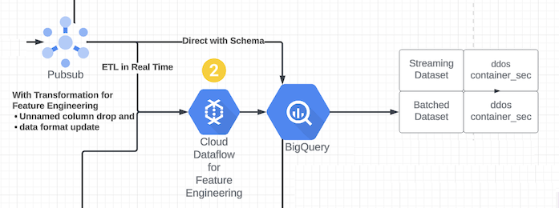

# Solution Accelerator for Security Analytics - Sprint 2: Realtime Ingestion and enrichment using Dataflow

This sprint shows reading data from a file to simulate a real-time experience and ingesting to a Cloud PubSub topic and storing into a BigQuery table. Cloud PubSub to BigQuery ingestion is done via Dataflow. Dataflow is also doing data enrichment.

## Tables of Contents

- [Solution Accelerator for Security Analytics - Sprint 2: Realtime Ingestion and enrichment using Dataflow](#solution-accelerator-for-security-analytics---sprint-2-realtime-ingestion-and-enrichment-using-dataflow)
  - [Overview](#overview)
  - [Components in action](#components-in-action)
  - [Prerequisites](#prerequisites)
  - [Steps](#steps)
  - [Exit criteria / e2e validation](#exit-criteria--e2e-validation)
  - [Resources created](#resources-created)
  - [Troubleshooting](#troubleshooting)

All sprints

- [Bootstrap](../00_bootstrap/README.md)
- [Sprint 1 - Realtime Ingestion](../01_realtime_ingestion/README.md)
- [Sprint 2 - Enrichment](../02_enrichment_dataflow/README.md) (current)
- [Sprint 3 - Feature Store](../03_feature_store/README.md)
- [Sprint 4 - Anomaly Detection](../04_anomaly_detection/README.md)
- [Sprint 5 - BQML](../05_bqml/README.md)
- [Sprint 6 - Visualization](../06_visualization/README.md)

## Sprint 2

### Overview

- [x] Create BigQuery tables
- [x] Create networking components
- [x] Create streaming Dataflow pipelines
- [x] Use sample data `<REPO_DIR>/data/ddos_sample.csv` and `<REPO_DIR>/data/syn_sample.csv`
- [x] Stream generated data to BigQuery: Client -> Pub/Sub topic -> Dataflow Streaming Job (BQ Flex template) -> BigQuery table

### Components in action



### Prerequisites

1. Validate and setup the environment
    > **Note**
    > Skip to next step if ran previously.

    - Activate Python virtual environment

        ```console
        source ~/venv-solacc/bin/activate
        ```

    - Verify gcloud configuration (authentication, project)

        ```console
        $ gcloud auth list
            Credentialed Accounts
          ACTIVE  ACCOUNT
          *       myuser@mydomain.com
                  otheruser@mydomain.com

        $ gcloud config get project
        <PROJECT_ID>
        ```

    - Change directory

        ```console
        cd security-analytics/src
        ```

2. Install python packages

    ```console
    pip install -U -r ./02_enrichment_dataflow/ddos/requirements.txt
    pip install -U -r ./02_enrichment_dataflow/syn/requirements.txt
    ```

### Steps

```Time required: 10 mins```

```Cost: $0 (part of free-tier)```

1. Provision the infrastructure using Terraform

   ```console
   cd 02_enrichment_dataflow
   terraform init 
   terraform plan -var-file=terraform.tfvars
   terraform apply -var-file=terraform.tfvars --auto-approve
   ```

    Takes about [5 to 19 mins]("https://github.githubassets.com/images/icons/emoji/unicode/23f3.png?v8")
    **Validate**: Terraform finishes successfully.

    ```console
    $ terraform apply -var-file=terraform.tfvars --auto-approve
    Apply complete! Resources: X added, Y changed, 0 destroyed.
    ```

    **Validate**: BQ dataset exists, and does not contain any data

    ```console
    $ . generated/environment.sh

    $ echo "$DATASET_ID.$SYN_TABLE_ID"
    streaming_lqu.syn_streaming

    $ bq query --project_id $PROJECT_ID --nouse_legacy_sql "select count(timestamp) from $DATASET_ID.$SYN_TABLE_ID"
    +-----+
    | f0_ |
    +-----+
    |   0 |
    +-----+

    $ echo "$DATASET_ID.$DDOS_TABLE_ID"
    streaming_lqu.syn_streaming

    $ bq query --project_id $PROJECT_ID --nouse_legacy_sql "select count(timestamp) from $DATASET_ID.$DDOS_TABLE_ID"
    +-----+
    | f0_ |
    +-----+
    |   0 |
    +-----+
    ```

2. Create / update data-catalog entries (no terraform support at the moment)

   ```console
   ./update_data_catalog_entries.sh
   ```

   **Validate**: Data Catalog entires are visible in the Console

3. Stream pre-generated sample data to Cloud Pub/Sub

    ```console
    $ cd ddos/
    $ . ../generated/environment.sh
    $ python3 ddos_streaming.py
    >> [X rows x Y columns]
    ```

    ```console
    $ cd ../syn/
    $ . ../generated/environment.sh
    $ python3 syn_streaming.py
    >> [X rows x Y columns]
    ```

    **Validate**: check if the BigQuery table has data
    > **Note**
    > Occasionally, it might take few minutes for the data to load.

    ```console
    $ bq query --project_id $PROJECT_ID --nouse_legacy_sql "select count(timestamp) from $DATASET_ID.$SYN_TABLE_ID"
    +-----+
    | f0_ |
    +-----+
    |  1000 |
    +-----+
    ```

    ```console
    $ bq query --project_id $PROJECT_ID --nouse_legacy_sql "select count(timestamp) from $DATASET_ID.$DDOS_TABLE_ID"
    +-----+
    | f0_ |
    +-----+
    |  1000 |
    +-----+
    ```

### Exit criteria / e2e validation

1. Terraform finishes successfully, no resources changed after the second run

    ```console
    cd ..
    terraform apply -var-file=terraform.tfvars --auto-approve
    Apply complete! Resources: 0 added, 0 changed, 0 destroyed.
    ```

2. The BigQuery streaming jobs are `Running`

    ```console
    $ gcloud dataflow jobs list --region us-central1 --status active
    JOB_ID                                    NAME                                                                   TYPE       CREATION_TIME        STATE    REGION
    2023-04-14_08_45_49-18338955757853504911  syn-streaming-job-lqu                                                  Streaming  2023-04-14 15:45:49  Running  us-central1
    2023-04-14_08_45_49-12169065628800380247  ddos-streaming-job-lqu                                                 Streaming  2023-04-14 15:45:49  Running  us-central1
    ```

3. The BigQuery tables have data in them

    ```console
    $ bq query --project_id $PROJECT_ID --nouse_legacy_sql "select count(timestamp) from $DATASET_ID.$SYN_TABLE_ID"
    +-----+
    | f0_ |
    +-----+
    |  1000 |
    +-----+
    ```

    ```console
    $ bq query --project_id $PROJECT_ID --nouse_legacy_sql "select count(timestamp) from $DATASET_ID.$DDOS_TABLE_ID"
    +-----+
    | f0_ |
    +-----+
    |  1000 |
    +-----+
    ```

### Resources created

| # | Resource | Purpose |
|---|---|---|
| 1 | BigQuery Tables | Tables `streaming_<RANDOMCHAR>.syn_streaming` and `streaming_<RANDOMCHAR>.ddos_streaming` to store data streamed real-time |
| 2 | PubSub Topics | Topics used to publish messagess to `syn-<RANDOMCHAR>`, `ddos-<RANDOMCHAR>` |
| 3 | Datacatalog entries | Schema for datacatalog |
| 4 | Networking components | VPC Network / Subnetwork / CloudNAT / Firewall to be used by Cloud Composer and Dataflow |
| 5 | Service Account | Service Account to be used by Cloud Composer and Dataflow |
| 6 | Dataflow Streaming Job | Dataflow streaming job `syn-streaming-job-<RANDOMCHAR>` and `ddos-streaming-job-<RANDOMCHAR>` based on BQ SQL flex template in RUNNING state|
| 7 | IAM role binding | Grant the Cloud Composer / Dataflow Service Account the required roles to access Cloud Pub/Sub, Cloud Storage, VertexAI, BigQuery, Dataflow, Cloud Composer |

### Troubleshooting

If the step with updating the data catalog is skipped, DataflowJobs are unable to start, and the following log message is shown in the Console:

```
Invalid/unsupported arguments for SQL job launch: Query uses unsupported SQL features: Entry doesn't have a schema. Please attach a schema to 'pubsub.topic.`PROJECT_ID`.`syn-7y4`' in Data Catalog: name: "projects/PROJECT_ID/locations/global/entryGroups/@pubsub/entries/cHJvamVjdHMvaXN2LWNvZS1wcmVkeS1kZGYxL3RvcGljcy9zeW4tN3k0" type: DATA_STREAM source_system_timestamps { create_time { seconds: 1690299731 nanos: 788000000 } update_time { seconds: 1690299731 nanos: 788000000 } } linked_resource: "//pubsub.googleapis.com/projects/PROJECT_ID/topics/syn-7y4" integrated_system: CLOUD_PUBSUB
```

**Resolution**: execute the `update_data_catalog_entries.sh` script.

---
[Next sprint](../03_feature_store/README.md)
