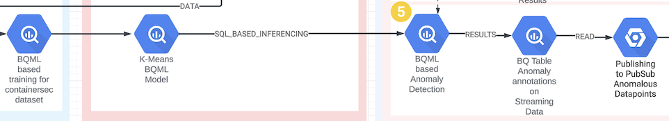

# Solution Accelerator for Security Analytics - Sprint 5: BigQueryML (BQML) model generation for Anomaly Detection

This sprint uses data from streaming and batching datasets to train a K-Means model for clustering. Anomaly detection is demonstrated and results are stored in a BigQuery table. All anomalies are alerted using PubSub.

## Tables of Contents

- [Solution Accelerator for Security Analytics - Sprint 5: BigQueryML (BQML) model generation for Anomaly Detection](#solution-accelerator-for-security-analytics---sprint-5-bigqueryml-bqml-model-generation-for-anomaly-detection)
  - [Overview](#overview)
  - [Components in action](#components-in-action)
  - [Prerequisites](#prerequisites)
  - [Steps](#steps)
  - [Exit criteria / e2e validation](#exit-criteria--e2e-validation)
  - [Resources created](#resources-created)

All sprints

- [Bootstrap](../00_bootstrap/README.md)
- [Sprint 1 - Realtime Ingestion](../01_realtime_ingestion/README.md)
- [Sprint 2 - Enrichment](../02_enrichment_dataflow/README.md)
- [Sprint 3 - Feature Store](../03_feature_store/README.md)
- [Sprint 4 - Anomaly Detection](../04_anomaly_detection/README.md)
- [Sprint 5 - BQML](../05_bqml/README.md) (current)
- [Sprint 6 - Visualization](../06_visualization/README.md)

## Sprint 5

```Time required: 20 mins```

```Cost: $16 per hour (including previous sprints)```

### Overview

- [x] Create a BQML K-Means Model using served data to perform clustering
- [x] Data will be batch served from Feature Store into BigQuery
- [x] ML.DETECT_ANOMALIES will be run on data in streaming data table with model trained in previous step
- [x] Results of anomaly detection will be in a BigQuery table
- [x] User notifications will be based on scanned and anomalous data to pubsub for alerting

### Components in action



### Prerequisites

1. This module is dependent on below sprints.
    1) Go through [Bootstrap module](../00_bootstrap/README.md)
    2) Go through [Sprint 1](../01_realtime_ingestion/README.md)
    3) Go through [Sprint 3](../03_feature_store/README.md)

2. Install python packages

```console
cd security-analytics/src/
pip install -U -r ./05_bqml/containersec/requirements.txt
```

### Steps

1. Provision the infrastructure using Terraform

   ```console
   cd 05_bqml
   terraform init
   terraform plan -var-file=terraform.tfvars
   terraform apply -var-file=terraform.tfvars --auto-approve
   ```

    **Validate**: Terraform finishes successfully.

    ```console
    $ terraform apply -var-file=terraform.tfvars --auto-approve
    Apply complete! Resources: X added, Y changed, 0 destroyed.
    ```

    > **Note**
    > for all subsequent commands source the generated `generated/environment.sh` file.

    ```console
    . ./generated/environment.sh
    echo $PROJECT_ID
    ```

2. Run the pipeline for BQML Model creation and publishing anomalies

    ```console
    cd containersec/
    python3 run_train_detect_publish_pipeline.py
    ```

    > **Note**
    > it might take up-to 20 minutes for the pipeline to run

    **Validate**: check if the BQML Model is created

    ```console
    $ bq ls -m --format=pretty $PROJECT_ID:batching_$RANDOM_SUFFIX
    +-----+-----------+---------+-------------+
    | Id | Model Type | Labels | Creation Time|
    +-----+-----------+---------+-------------+
    | containersec_model_<random_chars> | KMEANS  | | <Date Time> |
    +------------------------+---------+--+-----------+
    ```

    **Validate**: check if the inferenced dataset is created

    ```console
    $ bq ls $PROJECT_ID:inferenced_$RANDOM_SUFFIX
    +--------------------------------------+
    | tableId |
    +--------------------------------------+
    |  containersec_bqml_anomaly_detection |
    +--------------------------------------+
    ```

### Exit criteria / e2e validation

1. Terraform finishes successfully, no resources changed after the second run

    ```console
    $ cd 05_bqml
    $ terraform apply -var-file=terraform.tfvars --auto-approve
    Apply complete! Resources: 0 added, 0 changed, 0 destroyed.
    ```

2. The BigQuery table should have anomalous data

    ```console
    $ bq query --project_id $PROJECT_ID --nouse_legacy_sql "SELECT count(*) from inferenced_$RANDOM_SUFFIX.containersec_bqml_anomaly_detection WHERE is_anomaly=TRUE"
    +-----+
    | f0_ |
    +-----+
    |  25 |    
    +-----+
    ```

    > **Note**
    > This value could be different for you

3. An ALERT notification should be sent to the configured notification e-mail address.

### Resources created

| # | Resource | Purpose |
|---|---|---|
| 1 | BigQuery Model | K- Means Model `containersec_model_*`|
| 2 | BigQuery Table | Table to store anomalous data `inferenced_*.containersec_bqml_anomaly_detection` |
| 3 | BigQuery Table | Table to store training data served from FeatureStore `stg_modeling_*.containersec_served_fs` |
| 4 | Vertex AI Pipeline  `s05-containersec-train-detect-anomalies-<random-UUID>` | Created by `run_train_detect_publish_pipeline.py`|
| 5 | Alerting policy | `containersec` alerting policy to notify users on anomalous data|

---
[Next sprint](../06_visualization/README.md)
