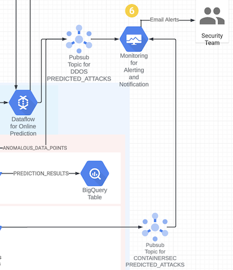
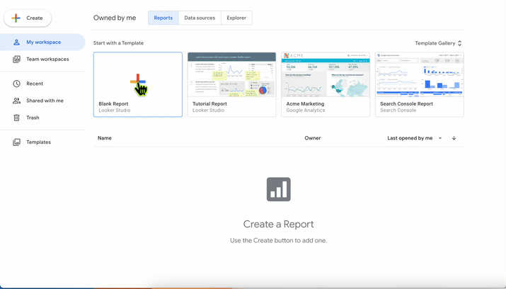

# Sprint 6: Visualization

This sprint demonstrates a dashboard developed using [Looker Studio](https://lookerstudio.google.com) that shows the various data paths and trigger patterns of Anomaly detection.

## Tables of Contents

- [Solution Accelerator for Security Analytics - Sprint 6: Visualization](#sprint-6-visualization)
  - [Components in action](#components-in-action)
  - [Prerequisites](#prerequisites)
  - [Steps](#steps)
  - [Visualizations](#visualizations)
  - [Exit criteria / e2e validation](#exit-criteria--e2e-validation)
  - [Resources created](#resources-created)

All sprints

- [Bootstrap](../00_bootstrap/README.md)
- [Sprint 1 - Realtime Ingestion](../01_realtime_ingestion/README.md)
- [Sprint 2 - Enrichment](../02_enrichment_dataflow/README.md)
- [Sprint 3 - Feature Store](../03_feature_store/README.md)
- [Sprint 4 - Anomaly Detection](../04_anomaly_detection/README.md)
- [Sprint 5 - BQML](../05_bqml/README.md)
- [Sprint 6 - Visualization](../06_visualization/README.md) (current)

### Components in action



## Prerequisites

```Time required: 20 mins```

### Steps

1. Setup infrastructure

    Generate configuration files and upload the configuration plus the DAG to Cloud Composer.

    ```console
    cd 06_visualization
    terraform init 
    terraform plan -var-file=terraform.tfvars
    terraform apply -var-file=terraform.tfvars --auto-approve
    ```

    **Validate**: Terraform finishes successfully.

    ```console
    $ terraform apply -var-file=terraform.tfvars --auto-approve
    Apply complete! Resources: X added, Y changed, 0 destroyed.
    ```

2. Wait for the DAG to execute and the Dataflow Steaming pipeline to became ready

    Wait until Cloud Composer executes the DAG and launched the streaming Dataflow Job. This may take ~20 minutes.

    **Validate**: Check in Composer / Airflow UI. Verify that the streaming Dataflow Job `ddos-predict-stream-<random_char>` is running.

3. Publish sample data

    ```console
    cd 06_visualization/ddos
    . ./generated/environment.sh
    python3 ddos_streaming_sampled.py
    ```

    **Validate**: Ingested data joined with the predication result is visible in the BQ table `inferenced_<random_char>.ddos_automl_online_predictions_s06` (there may be some ingestion delay).

    ```
    bq query --project_id $PROJECT_ID --nouse_legacy_sql "SELECT * except(json) FROM \`$PROJECT_ID.$INFERENCE_TARGET_DATASET.$INFERENCE_TARGET_TABLE\` ORDER BY \`timestamp\` DESC LIMIT 10"
    
    ```

### Visualizations

1. Create Report by visiting [Looker Studio](https://lookerstudio.google.com)

2. Graphic shows pointing to the BigQuery Table at: `inferenced_<random_char>.ddos_automl_online_predictions`

    

3. Graphic shows creating a report that uses the Source IP Address and Port, Destination IP Address and Port, Predict and Labels to show the `benign` and `ddos` rows of data. The report can be further customized and embedded for internal consumption.

    

4. Graphic shows creating a Dashboard that shows the Benign and DDoS attacks for the given dataset. Similar reports can be developed using `src_ip`, `src_port`, `dst_ip` and `dst_port`.

    

### Exit criteria

- DDoS
  - [x] File eval_dag_ddos.py in the `gs://us-central1-airflow2-<random_char>-<random_char>-bucket/dags` folder
  - [x] File eval_dag_pipeline_util.py in the `gs://ml-sec-<random_char>-us-central1-ddos` bucket
  - [x] File eval_ddos_settings.json in the `gs://ml-sec-<random_char>-us-central1-ddos` bucket
  - [x] Online prediction results are written to BigQuery table `inferenced_<random_char>.ddos_automl_online_predictions_s06`

### Resources created

| # | Resource | Purpose |
|---|---|---|
| 1 | Airflow | Airflow DAG `ddos-predict-stream-<random_char>` launching online prediction pipeline: Read from the `ddos-<random_char>` topic, do prediction using the `ad-ep-<random_char>` endpoint, write prediction results to `ddos-incidents-<random_char>` topic, write prediction responses to BigQuery table `inferenced_<random_char>.ddos_automl_online_predictions` |
| 2 | Dataflow Job | Streaming Dataflow Job `ddos-predict-stream-<random_char>` created by Airflow DAG `ddos-predict-stream-<random_char>` |
| 3 | BigQuery Table | BigQuery Table `inferenced_<random_char>.ddos_automl_online_predictions_s06` created by the streaming Dataflow job |

---
[Cleanup](../07_cleanup/README.md)
