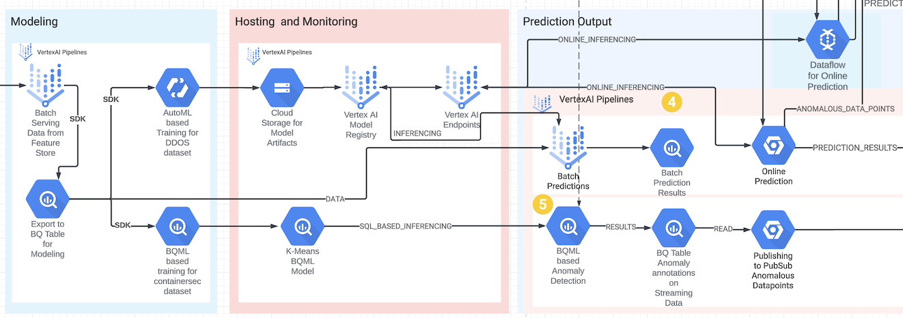

# Sprint 4: Anomaly Detection

This sprint demonstrates anomaly detection using FeatureStore and AutoML and Vertex AI Model Registry]

## Tables of Contents

- [Solution Accelerator for Security Analytics - Sprint 4: Anomaly Detection](#sprint-4-anomaly-detection)

  - [Components in action](#components-in-action)
  - [Prerequisites](#prerequisites)
  - [Common Setup](#common-setup)
    - [Steps](#steps)
    - [Resources created](#resources-created)
    - [Exit criteria](#exit-criteria)
  - [Upload an Existing model](#upload-an-existing-model)
    - [Steps](#steps-1)
    - [Resources created](#resources-created-1)
    - [Exit criteria](#exit-criteria-1)
  - [Train, deploy, evaluate and do predictions with the model](#train-deploy-evaluate-and-do-predictions-with-the-model)
    - [Prerequisites](#prerequisites-1)
    - [Steps for training](#steps-for-training)
    - [Steps for evaluation + prediction](#steps-for-evaluation--prediction)
    - [Steps for prediction only](#steps-for-prediction-only)
    - [Steps for testing online predictions manually](#steps-for-testing-online-predictions-manually)
    - [Resources created](#resources-created-2)
    - [Exit criteria](#exit-criteria-2)
  - [Troubleshooting](#troubleshooting)

All sprints

- [Bootstrap](../00_bootstrap/README.md)
- [Sprint 1 - Realtime Ingestion](../01_realtime_ingestion/README.md)
- [Sprint 2 - Enrichment](../02_enrichment_dataflow/README.md)
- [Sprint 3 - Feature Store](../03_feature_store/README.md)
- [Sprint 4 - Anomaly Detection](../04_anomaly_detection/README.md) (current)
- [Sprint 5 - BQML](../05_bqml/README.md)
- [Sprint 6 - Visualization](../06_visualization/README.md)

### Components in action



## Prerequisites

- [x] This module is dependent on below sprints.
  - Go through module 0 above
  - Go through module 1 above
  - Go through module 2 above

## Common Setup

```Time required: 5 mins```

```Cost: $15 per hour (including previous sprints)```

### Steps

1. Provide email address for notifications

   a. Create terraform.tfvars

   b. Update value for `var.notification_email_addresses`

      ```console
      notification_email_addresses = ["<username@domain.com>"]
      ```

2. Setup infrastructure

    ```console
    cd solution-accelerators/security-analytics/src/04_anomaly_detection
    terraform init 
    terraform plan -var-file=terraform.tfvars
    terraform apply -var-file=terraform.tfvars --auto-approve
    ```

    > **Note**
    > Terraform populates the templated files with environment specific values to create an instance of files in the `generated` folder.

    **Validate**: Terraform finishes successfully.

    ```console
    $ terraform apply -var-file=terraform.tfvars --auto-approve
    Apply complete! Resources: X added, Y changed, 0 destroyed.
    ```

### Resources created

| # | Resource | Purpose |
|---|---|---|
| 1 | PubSub topic `ddos_incidents-<random_char>` | Incidents reported to this topic for DDoS |
| 2 | PubSub topic `containersec_incidents-<random_char>` | Incidents reported to this topic for Container Security |
| 3 | Cloud Storage / folder + files `gs://ml-sec-<random_char>-us-central1-ddos/model/uploaded3` | Bucket to holder model related data |
| 5 | VertexAI Online Prediction Endpoint `ad-ep-<random_char>` | Vertex Endpoint |
| 6 | Alerting Notification Channel | Used to notify alerts |
| 7 | Alerting Policy | Sends alerts based on configured policy and threshold |

### Exit criteria

- [x] The resources mentioned above are created.

## Upload an Existing model

Upload an existing model from `ddos_upload_model\model` (to save time - no need to wait for the training) and deploy to the endpoint.

```Time required: 5-10 mins```

### Steps

1. Execute script to create model from the uploaded model

    ```console
    cd ddos_upload_model
    ./create_and_deploy_model_from_upload.sh
    ```

    **Validate**: model created: visible in the UI or in the gcloud output

    ```console
    cd 04_anomaly_detection/ddos_upload_model
    . ../generated/environment.sh
    gcloud ai models list --project $PROJECT_ID --region $REGION
    ```

    The above command should list the model details:
    | MODEL_ID | DISPLAY_NAME |
    |---|---|
    | <123456789> |anomaly-detection-<random_char>-uploaded |

### Resources created

| # | Resource | Purpose |
|---|---|---|
| 1 | VertexAI Model `anomaly-detection-<random_char>-uploaded` | Vertex AI Model deployed |

### Exit criteria

- [x] The resources mentioned above are created.
- [x] The VertexAI Online Prediction endpoint `ad-ep-<random_char>` has the model `anomaly-detection-<random_char>-uploaded (Version 1)` deployed

## Train, deploy, evaluate and do predictions with the model

Train a new model and deploy to the endpoint.

```Time required: ~3.5 hours```

### Prerequisites

```Time required: 1 min```

1. Install python packages

    ```console
    cd ..
    pip install -U -r ddos/requirements.txt
    ```

### Steps for training

```Time required: 3.5 hrs```

1. Execute VertexAI Pipeline

    ```console
    cd ddos
    python3 run_pipeline_feature_store_train_deploy_automl_model.py
    ```

    **Validate**: pipeline execution finishes successfully, and the trained model is visible in the console.
    > **Note**
    > This could run for 3 to 3.5 hours

### Steps for evaluation + prediction

```Time required: 45 mins```

The pipeline will use the latest model with prefix `anomaly-detection-<random_char>`.

1. Execute evaluation + prediction pipeline

    ```console
    cd 04_anomaly_detection/ddos
    python3 run_evaluate_predication_pipeline.py
    ```

    **Validate**: pipeline execution finishes successfully, and model evaluation is visible in the console.

### Steps for prediction only

The pipeline will use the latest model with prefix `anomaly-detection-<random_char>`.

1. Execute prediction pipeline

    ```console
    cd 04_anomaly_detection/ddos
    python3 run_do_predication_pipeline.py
    ```

    **Validate**: pipeline execution finishes successfully, and predictions are ingested into BigQuery.

    ```
    bq://<PROJECT_ID>.inferenced_<RANDOM_CHARS>.predictions_<GENERATED_TIMESTAMP>
    bq://<PROJECT_ID>.inferenced_<RANDOM_CHARS>.ddos_automl_online_predictions
    ```

### Steps for testing online predictions manually

1. Setup environment

    ```console
    cd 04_anomaly_detection
    . ./generated/environment.sh
    echo "REGION=$REGION"
    echo "ENDPOINT_NAME=$ENDPOINT_NAME"
    echo "PROJECT_ID=$PROJECT_ID"
    export BENIGN_SAMPLE_REQ_JSON="../data/ddos_sample_benign_predict_request.json"
    export DDOS_SAMPLE_REQ_JSON="../data/ddos_sample_ddos_predict_request.json"
    ```

2. Send `Benign` request

    ```console
    curl -X POST -H "Authorization: Bearer $(gcloud auth print-access-token)" -H "Content-Type: application/json" https://${REGION}-aiplatform.googleapis.com/v1/projects/${PROJECT_ID}/locations/us-central1/endpoints/${ENDPOINT_NAME}:predict -d "@${BENIGN_SAMPLE_REQ_JSON}"
    ```

    ```json
    {
      "predictions": [
        {
          "classes": [
            "Benign",
            "ddos"
          ],
          "scores": [
            0.997606635093689,
            0.00239335116930306
          ]
        }
      ],
      "deployedModelId": "7235439620672978944",
      "model": "projects/715227306134/locations/us-central1/models/6356190958266089472",
      "modelDisplayName": "anomaly-detection-7y4-uploaded",
      "modelVersionId": "1"
    }
    ```

3. Send `ddos` request

    ```console
    curl -X POST -H "Authorization: Bearer $(gcloud auth print-access-token)" -H "Content-Type: application/json" https://${REGION}-aiplatform.googleapis.com/v1/projects/${PROJECT_ID}/locations/us-central1/endpoints/${ENDPOINT_NAME}:predict -d "@${DDOS_SAMPLE_REQ_JSON}"
    ```

    ```json
    {
      "predictions": [
        {
          "scores": [
            0.01545260846614838,
            0.98454737663269043
          ],
          "classes": [
            "Benign",
            "ddos"
          ]
        }
      ],
      "deployedModelId": "7235439620672978944",
      "model": "projects/715227306134/locations/us-central1/models/6356190958266089472",
      "modelDisplayName": "anomaly-detection-7y4-uploaded",
      "modelVersionId": "1"
    }
    ```

### Resources created

| # | Resource | Purpose |
|---|---|---|
| 1 | VertexAI Pipeline `s04-ddos-feature-store-train-deploy-automl-model-<random UUID>` | Created by `run_pipeline_feature_store_train_deploy_automl_model.py` |
| 2 | VertexAI Pipeline `s04-ddos-evaluate-do-online-prediction-<random UUID>` | Created by `run_evaluate_predication_pipeline.py` |
| 3 | VertexAI Pipeline `s04-ddos-do-online-prediction-<random UUID>` | Created by `run_do_predication_pipeline.py` |
| 4 | Dataflow Batch Job `automl-tabular-transform-<number1>-<number2` | Created by `s04-ddos-feature-store-train-deploy-automl-model-<random UUID>` |
| 5 | Dataflow Batch Job `automl-tabular-transform-<number1>-<number2` | Created by `s04-ddos-feature-store-train-deploy-automl-model-<random UUID>` |
| 6 | VertexAI Model `anomaly-detection-<random_char>-uploaded` | Uploaded by `create_and_deploy_model_from_upload.sh` |
| 6 | VertexAI Model `anomaly-detection-<random_char>-trained` | Trained by `s04-ddos-feature-store-train-deploy-automl-model-<random UUID>` |
| 7 | BigQuery Table `bq://<PROJECT_ID>.stg_modeling_<RANDOM_CHARS>.ddos_served_fs` | Created by `s04-ddos-feature-store-train-deploy-automl-model-<random UUID>` |
| 8 | Dataflow Batch Job `evaluation-<number1>-<number2>-evaluation-run` | Created by `s04-ddos-evaluate-do-online-prediction-<random UUID>` |
| 9 | BigQuery Table `bq://<PROJECT_ID>.inferenced_<RANDOM_CHARS>.predictions_<GENERATED_TIMESTAMP>` | Created by `s04-ddos-evaluate-do-online-prediction-<random UUID>` |
| 10 | BigQuery Table `bq://<PROJECT_ID>.inferenced_<RANDOM_CHARS>.ddos_automl_online_predictions` | Created by `s04-ddos-evaluate-do-online-prediction-<random UUID>` |

### Exit criteria

- [x] The resources mentioned above are created.
- [x] The VertexAI Online Prediction endpoint `ad-ep-<random_char>` has the model `anomaly-detection-<random_char>-trained (Version 1)` deployed

### Troubleshooting

1. If below error occurs while uploading the model:

    ```console
    $ cd 04_anomaly_detection/ddos_upload_model
    $ ./create_and_deploy_model_from_upload.sh
    ERROR: can't find model anomaly-detection-1qr-uploaded
    ```

    Re-run the command as there might be a lag for model to be fully available.

    ```console
    cd 04_anomaly_detection/ddos_upload_model
    ./create_and_deploy_model_from_upload.sh
    ```

---
[Next sprint](../05_bqml/README.md)
