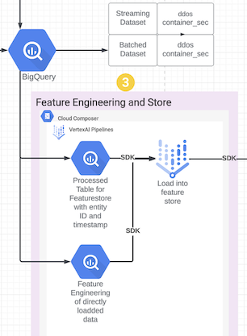

# Solution Accelerator for Security Analytics - Sprint 3: Feature Store

This sprint shows a feature engineering platform for Security Analytics. Milestone involve building an enrichment pipeline that reads data from GCS to a Dataflow job that writes to Vertex AI Feature Store.

## Tables of Contents

- [Solution Accelerator for Security Analytics - Sprint 3: Feature Store](#solution-accelerator-for-security-analytics---sprint-3-feature-store)
  - [Overview](#overview)
  - [Components in action](#components-in-action)
  - [Prerequisites](#prerequisites)
  - [Steps](#steps)
  - [Exit criteria](#exit-criteria)
  - [Resources created](#resources-created)
  - [Security Permissions](#security-permissions)

## Sprint 3

```console
Time required: 1 hour. Composer uses around 30 minutes to run. Actual load job from dataflow - bigquery - feature store takes around 20 minutes
```

All sprints

- [Bootstrap](../00_bootstrap/README.md)
- [Sprint 1 - Realtime Ingestion](../01_realtime_ingestion/README.md)
- [Sprint 2 - Enrichment](../02_enrichment_dataflow/README.md)
- [Sprint 3 - Feature Store](../03_feature_store/README.md) (current)
- [Sprint 4 - Anomaly Detection](../04_anomaly_detection/README.md)
- [Sprint 5 - BQML](../05_bqml/README.md)
- [Sprint 6 - Visualization](../06_visualization/README.md)

### Overview

- [x] Create BigQuery datasets
- [x] Create GCS buckets
- [x] Upload sample data to GCS
- [x] Create a Composer V2 environment (DDoS)
  - [x] Create a Feature Store from the Composer DAG
- [x] Create a VertexAI Pipeline (Containersec)
  - [x] Create a Feature Store from the VertexAI Pipeline

### Components in action



### Prerequisites

```Time required: 1 min```

1. This module is dependent on below sprints.
        1) Go through module 0 above
        2) Go through module 1 above
        3) Go through module 2 above

2. Install python packages

    ```console
    cd security-analytics-accelerators/src
    pip install -U -r ./03_feature_store/containersec/requirements.txt
    ```

### Steps

```Time required: 45 mins```

```Cost: $10 per hour OR $30 for length of workshop```

1. Setup infrastructure

    ```console
    cd 03_feature_store

    terraform init 
    terraform plan -var-file=terraform.tfvars
    terraform apply -var-file=terraform.tfvars --auto-approve
    ```

2. For the Container Sec Dataset

    This will trigger a Vertex AI Pipeline.

    ```console
    cd containersec
    python run_pipeline.py
    ```

3. For ddos dataset

   Goto the Composer Environment and launch from the Airflow UI created by terraform code. Locate the DAG named `ddos-etl-fea-<random_char>-dly` and launch it if it's not running / hasn't been launched already.

### Exit criteria

- ContainerSec
  - [x] BigQuery Table named `batching_<random_char>.containersec` with data in it
  - [x] BigQuery Table named `batching_<random_char>.containersec_before_fs` with data in it
  - [x] Vertex AI Pipeline shall be created
  - [x] Vertex AI Feature Store shall be created in the Feature Store service. Name can be read from containersec_settings.json file.
  - [x] Vertex AI Feature Store in Feature Store service with name `containersec_fs_<random_char>`

- DDoS
  - [x] File dag_pipeline_util.py in the `ml-sec-<random_char>-us-central1-ddos bucket`
  - [x] File ddos_settings.json in the `ml-sec-<random_char>-us-central1-ddos bucket`
  - [x] File dag_ddos.py in the `gs://us-central1-airflow2-<random_char>-<random_char>-bucket/dags` folder
  - [x] DAG named ddos-etl-fea-eng-dly in the Airflow UI in Cloud Composer
  - [x] BigQuery Dataset in Bigquery `batching_<random_char>.ddos` with data in it
  - [x] Vertex AI Pipeline shall be created
  - [x] Vertex AI Feature Store in Feature Store service with name `ddos_fs_<random_char>`

### Resources created

| # | Resource | Purpose |
|---|---|---|
| 1 | BigQuery Table | Table with containersec data `batching_<RANDOMCHARS>.containersec` |
| 1 | BigQuery Table | Table with containersec data `batching_<RANDOMCHARS>.containersec_before_fs` |
| 2 | Vertex AI Pipeline | Pipeline created for feature engineering of containersec data|
| 3 | Vertex AI Feature Store | Feature Store to store container sec features |
| 4 | Composer with DDoS DAG | Composer to run the Ddos Pipeline |
| 5 | BigQuery Table | Table with DDoS batch data `batching_<RANDOMCHARS>.ddos` |
| 6 | Vertex AI Pipeline | Pipeline created for feature engineering of DDoS data |
| 7 | Vertex AI Feature Store | Feature Store to store ddos features |

### Security Permissions

| # | IAM | Purpose |
|---|---|---|
| 1 | Security Permissions | Grant Service Account User, Composer Worker, Big Query Admin, Datacatalog Admin, Dataflow Developer, Dataflow Worker, Composer Admin, Container Cluster Admin, Pub Sub Admin, Storage Admin, AI Platform Admin, Cloud Source Repo Admin, Service Usage Consumer to System generated Dataflow service account |
| 2 | Security Permissions | Grant Service Agent to System generated Cloud Composer service account |
| 3 | Security Permissions | Grant Editor to System generated Cloud Services service account |

---
[Next sprint](../04_anomaly_detection/README.md)
